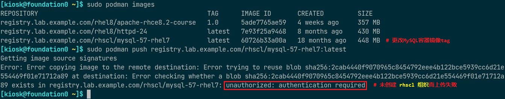
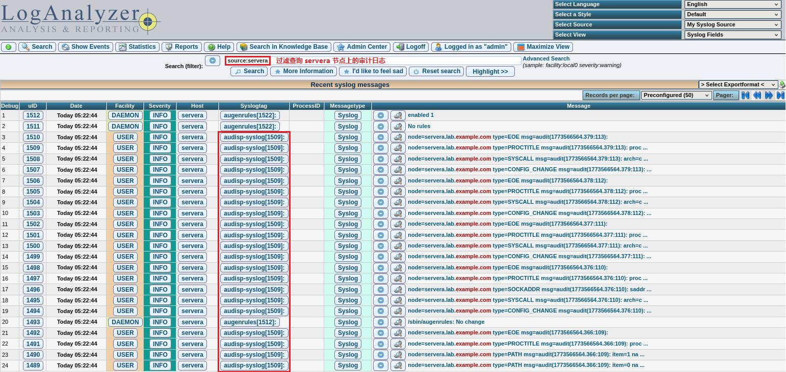

# 部署 LogAnalyzer 可视化管理与分析日志

[](https://quay.io/repository/alberthua/loganalyzer-viewer)

## 文档说明

| Podman 版本 | LogAnalyzer 版本 |
| ----- | ----- |
| podman-1.9.3-2.module+el8.2.1+6867+366c07d6.x86_64 | loganalyzer-4.1.11.tar.gz |
| podman-4.4.1-3.el9.x86_64 | loganalyzer-4.1.11.tar.gz |

- 本文使用 Podman 容器运行时在 RHEL8 与 RHEL9 作为宿主机进行测试并通过。
- LogAnalyzer 项目基于 PHP 开发，将其封装于 Apache HTTPD server 中可作为 MySQL 数据库检索分析日志数据的 Web 前端。
- LogAnalyzer 与 MySQL 均封装在 Podman 容器镜像中运行（本文中在同一节点上运行）。

## 架构示意

<center></center>

<center>rsyslog 服务端收集来自不同 rsyslog 客户端发送的系统日志数据</center>

## LogAnalyzer 与 MySQL 的容器部署

- 部署用 Shell 脚本参考此 [链接](https://github.com/Alberthua-Perl/sc-col/blob/master/rsyslog-loganalyzer-viewer/el8/rsyslog_viewer_el8-new.sh)。
- 部署 loganalyzer 与 mysql 容器：

  ```bash
  #示例：serverb 上执行
  $ sudo sh ./rsyslog_viewer_el8-new.sh
  # 此脚本中包含相关用户名、密码与 IP 地址，请根据实际情况更改调整。
  ```
  
- 添加 rsyslog 客户端：

  ```bash
  #示例：servera 上执行
  $ sudo sh ./rsyslog_client_el8.sh
  ``` 

- loganalyzer 容器与 mysql 容器部署成功且正常运行后，需访问 loganalyzer 容器所在节点以完成两者的对接，如下所示：

  <center></center>

  <center></center>
    
  <center></center>

  <center></center>

  <center></center>

  <center></center>

  <center></center>

  <center></center>

  <center></center>

  <center></center>

> 说明： 
> 若环境中存在 Red Hat Quay 3.3.0 容器镜像仓库，需将 mysql-57-rhel7:latest 上传至该容器镜像仓库中的 rhscl organization 中。<br>
> 将容器镜像上传至 Quay 中，需提前创建相应的 organizaion，否则将上传失败报错！
> 
> 
>
> 
>
> 若环境中不存在 Quay 容器镜像仓库，可 **忽略** 此说明中的信息。

- 以下内容已在脚本中实现，此处仅作说明：
  - 务必关闭并禁用节点 firewalld 服务，此服务与 iptables NAT 规则冲突，在启用的情况下将无法实现容器的端口映射，iptables NAT 规则无法建立。
  - 由于 loganalyzer 容器与 mysql 容器均位于同一节点上，且容器通过 **CNI bridge (podman0)** 连接，因此 loganalyzer 连接 mysql 时应使用节点的 IP 地址，但 mysql 对指定用户的授权语句应使用 CNI Gateway 的 IP 地址，否则在前端 Web 上无法建立连接。

   ```sql
   GRANT ALL ON Syslog.* TO '${SYSLOG_USER}'@'${CNI_GATEWAY}' IDENTIFIED BY '${SYSLOG_PASS}';
   ```

  - loganalyzer 容器镜像基于 Apache HTTPD server 构建，可参考此 [链接](https://github.com/Alberthua-Perl/sc-col/tree/master/rsyslog-loganalyzer-viewer/loganalyzer-viewer) 进行封装。
  - 由于使用 mysql 的 Red Hat 官方镜像，启动容器时不使用 root 用户运行 mysql 守护进程，而使用 **UID 27** (mysql) 运行，需设置宿主机映射目录的所有者与所属组，不更改将无法运行容器。容器中报错日志如下所示：
    
  <center></center>

## LogAnalyzer 的常规部署要点

- loganalyzer 也可直接使用解压的压缩包（PHP 源码）实现安装，方法位于 [此脚本](https://github.com/Alberthua-Perl/sc-col/blob/master/rsyslog-loganalyzer-viewer/el8/rsyslog_viewer_el8.sh) 的最后注释部分。
- SELinux 为 enforcing 模式时，loganalyzer 无法与 mysql 连接，需打开 PHP 与 MySQL的网络连接布尔值以支持。

  <center></center>
 
## LogAnalyzer 集成 auditd 日志

auditd 日志与其审计日志默认不被 rsyslog 日志系统采集管理，因此需要额外的 audispd-plugins 插件的支持，如下所示：
 
```bash
$ sudo dnf install -y audispd-plugins          # 安装插件
$ sudo vim /etc/audit/plugins.d/syslog.conf    # 将审计日志定向于 rsyslog，rsyslog 日志又将传输至远程 rsyslog 服务端。
  ...
  active = yes
  ...
$ sudo service auditd restart                  # 重启 auditd 守护进程生效配置
```

<center></center>

<center>auditd 日志已同步</center>
  
## 参考链接

- [loganalyzer | GitHub](https://github.com/rsyslog/loganalyzer)
- [LogAnalyzer 概述](https://blog.csdn.net/zyqash/article/details/132559749)

