# 部署 LogAnalyzer 可视化管理与分析日志

[](https://quay.io/repository/alberthua/loganalyzer-viewer)

## 文档说明

| OS 版本 | Podman 版本 | LogAnalyzer 版本 |
| ----- | ----- | ----- |
| Red Hat Enterprise Linux release 8.2 (Ootpa) | podman-1.9.3-2.module+el8.2.1+6867+366c07d6.x86_64 | loganalyzer-4.1.11.tar.gz |
| Red Hat Enterprise Linux release 9.2 (Plow) | podman-4.4.1-3.el9.x86_64 | loganalyzer-4.1.11.tar.gz |

本文使用 yum 安装软件包，若未指定特定版本，均为系统自带。

## 架构示意

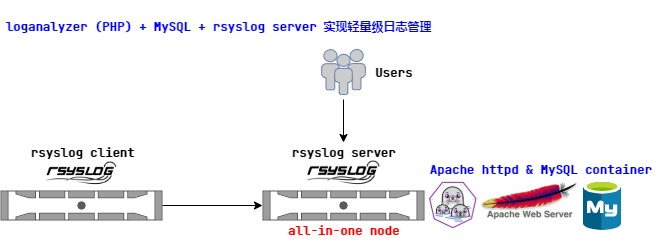

如图所示，`rsyslog-server` 服务端收集来自 `rsyslog-client` 客户端发送的指定系统日志数据，并且 Apache HTTPD server 与 MySQL 数据库均以容器的方式一同部署于服务端。

## LogAnalyzer 与 MySQL 的容器部署要点

- 部署用 Shell 脚本参考该 [链接](https://github.com/Alberthua-Perl/sc-col/blob/master/deploy-rsyslog-viewer/deploy-rsyslog-viewer.sh)。
- 部署用节点：
  - serverb.lab.example.com (RH294v8.0 course)：2 vCPU，4GiB RAM
  - firewalld 服务已禁用
  - SELinux 为 enforcing 模式
- 此次使用 Podman 容器运行时运行所有容器。
- 该部署环境中已预配置 `Red Hat Quay 3.3.0`，并且已将 `mysql-57-rhel7:latest` 上传至该容器镜像仓库中的 `rhscl organization` 中。
- 将容器镜像上传至 Quay 中，需提前创建相应的 organizaion，否则将上传失败报错！

  

  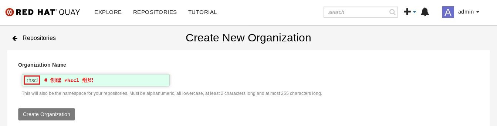

- 务必关闭并禁用节点 `firewalld` 服务，该服务与 `iptables NAT` 规则冲突，在启用的情况下将无法实现容器的端口映射，iptables NAT 规则无法建立！
- 由于 loganalyzer 容器与 MySQL 容器均位于同一节点上，且容器通过 `CNI bridge` (cni-podman0) 连接，因此 loganalyzer 连接 MySQL 时应使用节点的 IP 地址，但 MySQL 对指定用户的授权语句应使用 `CNI Gateway` 的 IP 地址，否则在前端 Web 上无法建立连接。

   ```sql
   grant all on Syslog.* to '${SYSLOG_USER}'@'${CNI_GATEWAY}' identified by '${SYSLOG_PASS}';
   ```

- loganalyzer 容器镜像基于 `Apache HTTPD server` 构建，可参考该 [链接](https://github.com/Alberthua-Perl/Dockerfile-examples/tree/master/loganalyzer-viewer)。
- loganalyzer 项目基于 PHP 开发，可作为 MySQL 数据库检索日志数据的 Web 前端。
- MySQL 容器使用持久化存储（卷映射）时，由于使用 Red Hat 官方镜像，启动容器时不使用 root 用户运行 mysql 守护进程，而使用 **UID 27** (mysql) 运行，需设置宿主机映射目录的所有者与所属组，不更改将无法运行容器。容器中报错日志如下所示：
    
  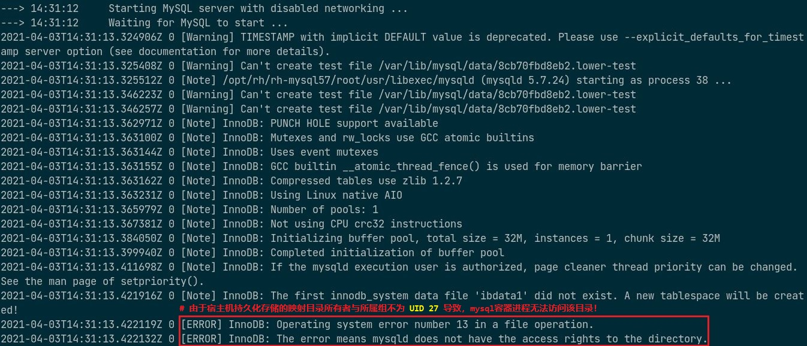

- loganalyzer 容器与 MySQL 容器部署成功且正常运行后，需访问 loganalyzer 容器所在节点以完成两者的对接，如下所示：

  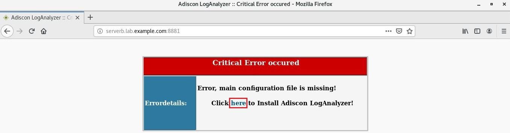

  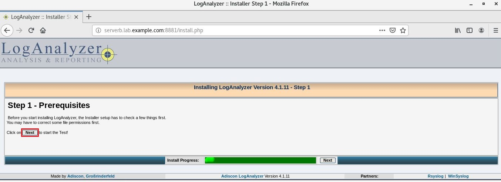
    
  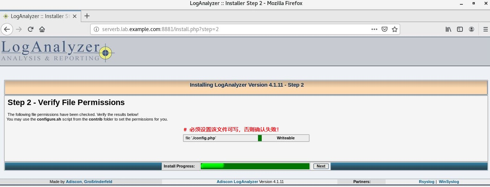

  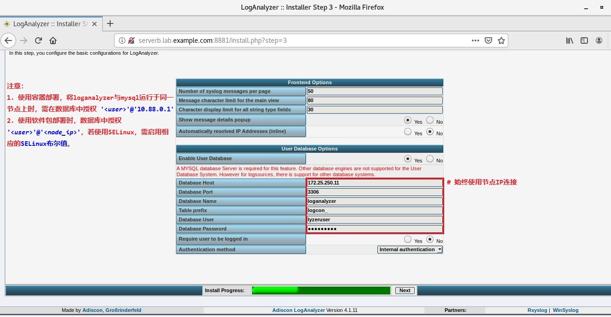

  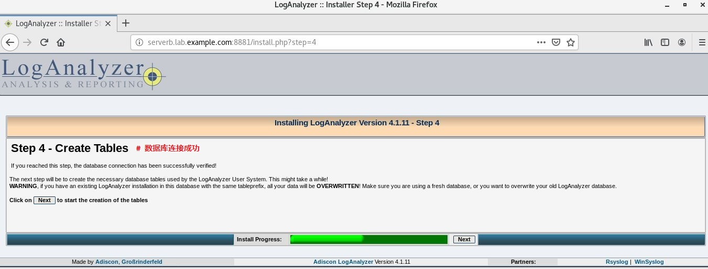

  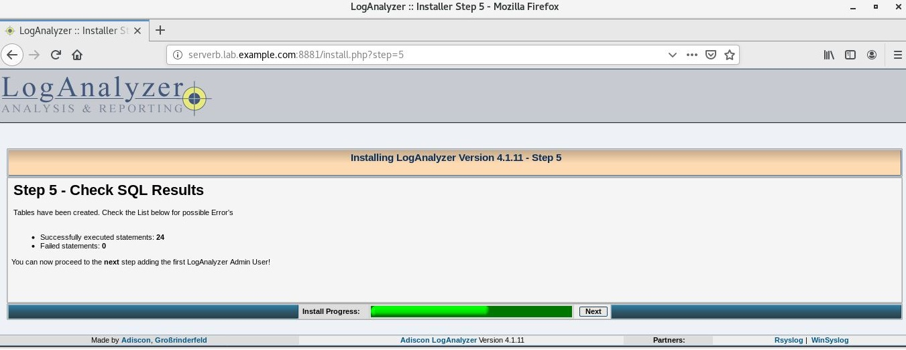

  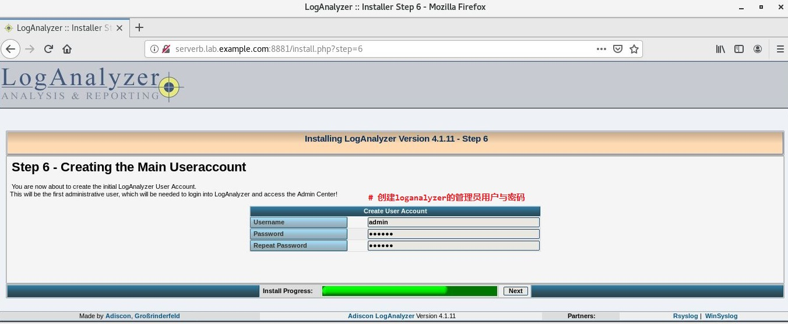

  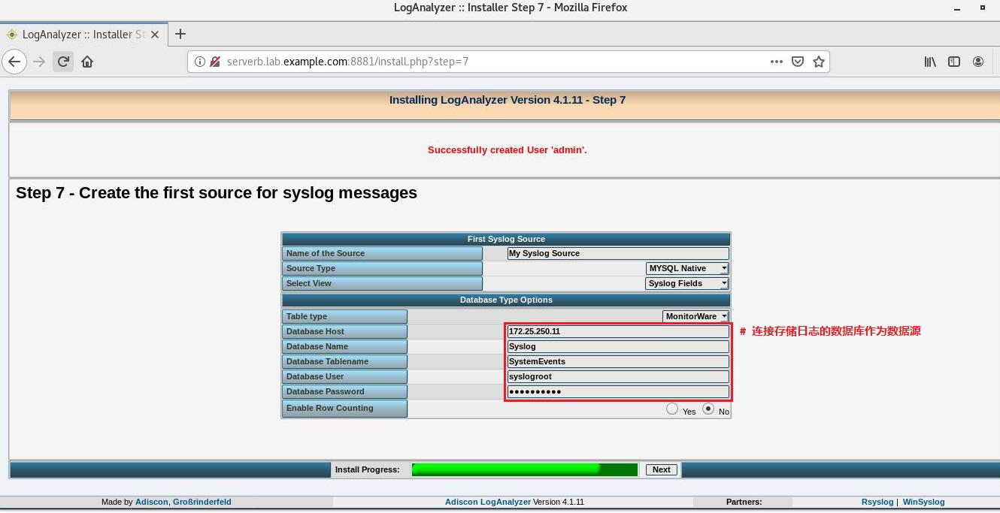

  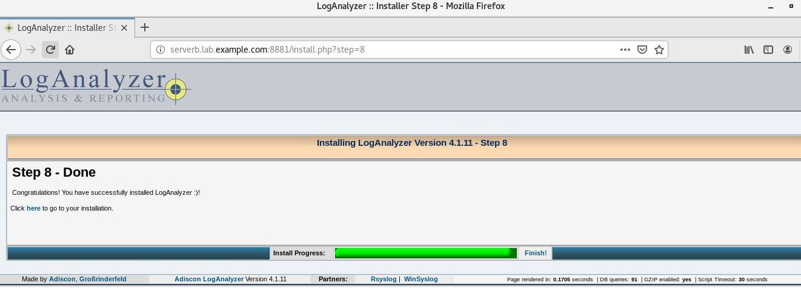

  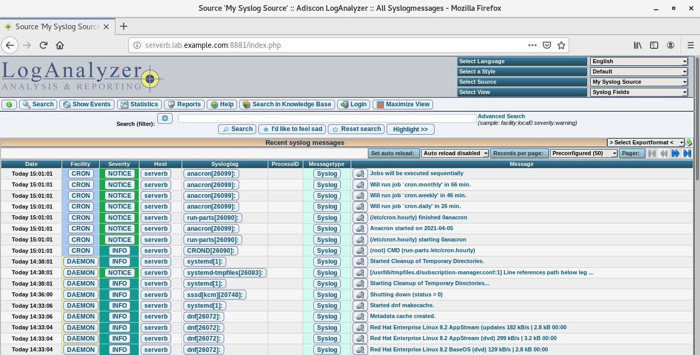

## LogAnalyzer 的常规部署要点

- LogAnalyzer 也可直接使用解压的压缩包（PHP 源码）实现安装，方法位于部署脚本的最后注释部分。
- SELinux 为 enforcing 模式时，LogAnalyzer 无法与 MySQL 容器连接，需打开 PHP 与 MySQL的网络连接布尔值以支持。

  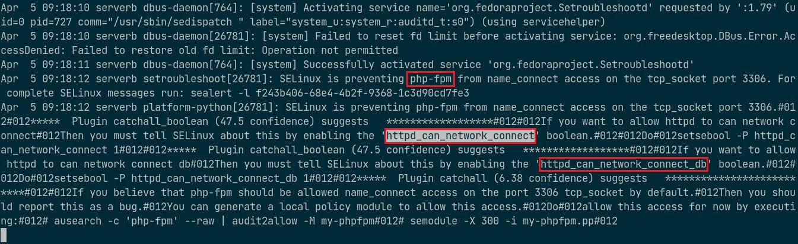

